# Deal Flow SOP — Shortest Path from Call to Funded

The one reliable path: **qualify on the phone → Plaid link on the same call →
model + credit pull → one DocuSign sitting (MCA agreement + MPA) → board →
fund.** Target: 48–72 hours from first call to wire. Everything below maps to
what the app already enforces — stage names, buttons, and automations are the
real ones.

**In the CRM, this whole flow runs from one page: the Deal Room** (lead
detail → "Deal Room", or Agent Desk → "Deal Room"). Every send and every
signature below — Plaid link, DLT-APP, MCA (in person or email), Delt
countersignature, MPA + site survey — happens there, and "Mark funded" is
blocked server-side until the packet is complete. Rollout/setup:
`docs/deal-room-rollout.md`.

```mermaid
flowchart LR
  A[Lead in CRM<br/>stage: New] -->|qualify call<br/>same day| B[Plaid link sent]
  B -->|merchant connects<br/>~2 min| C[Underwriting:<br/>Intake → Plaid Verification]
  C -->|model PRE_APPROVE / REVIEW| D[Credit Check + MCA History]
  D --> E[Final Review → Approved<br/>terms set]
  E --> F[One signing sitting:<br/>MCA agreement + MPA]
  F --> G[Board processor<br/>Luqra / Paysafe / Square]
  G --> H[Fund via ACH<br/>capital_deals: active]
```

---

## Stage 0 — Speed to lead (automated SLA: 1 business hour)

- `sla-watch` emails staff when a lead sits in **New** > 1 business hour;
  `stale-lead-digest` lists anything in New > 2 days. Don't let either fire.
- Work the qualification call from `docs/sales/mca-qualification-call.md`
  (EN/ES). The phone gates there mirror the decision model's hard knockouts —
  if they fail on the phone, they fail in the model, so kill it early.
- Dead file → move to **Not Qualified** immediately so the digest stays honest.

## Stage 1 — Signed application + Plaid link (on the call, never "after")

1. **Get the application signed at intake** — the Delt Capital Merchant
   Funding Application (Form DLT-APP, = the Jotform online application).
   Owner 1 signs; the rep signs as submitter. Section A is the merchant's
   authorization for credit pulls and verification — nothing downstream
   (bureau pull, DataMerch) is allowed until this is signed.
2. Form DLT-APP Section G requires **with every submission**: the signed
   application, business bank statements, government photo ID, and a voided
   business check. Ask for ID + voided check on this call; statements come
   from the merchant only if Plaid doesn't connect.
3. Send the **Plaid bank-connection link** while still on the phone. Stay on
   the line until the merchant completes it — completion rate collapses once
   you hang up. Plaid pulls land in the vault (`underwriting_inputs`,
   transactions, cash flow, identity).
4. **Plaid fails / bank unsupported** → fallback: collect 3–4 months of bank
   statements (upload as `doc_kind: statement`) and run
   `analyze-statement`. This is the slow path; treat it as the exception.

## Stage 2 — Underwriting (stages: Intake → Plaid Verification → Credit Check → MCA History → Final Review)

The Cash-Flow Decision Model (v1.0.0, deterministic, full trace) runs off the
Plaid snapshot. Its policy is the underwriting box — the same numbers the call
gates use:

| Gate | Threshold |
|---|---|
| Data sufficiency | ≥ 3 months of data, ≥ 50 transactions |
| Monthly revenue | ≥ $8,000 |
| NSF/overdrafts | ≤ 5 in 90 days, none in the last 7 days |
| Balance floor | no sustained daily balances below −$500 |
| Revenue trend | not down 30%+ over 3 months |
| Open positions | ≤ 2 detected loan/MCA positions |
| Debt service | < 25% of revenue |

Score bands: **≥ 65 = PRE_APPROVE**, 50–64 = REVIEW, else DECLINE. Tiers set
pricing: Tier 1 (factor 1.20–1.30, 12 mo) down to Tier 4 (1.45–1.49, 6 mo).
Offer = **minimum** of revenue multiple, affordability, 10× average daily
balance, and requested amount; floor $5,000; daily payment stress-tested at
≤ 15% of ADB.

**A model PRE_APPROVE is never a clearance by itself.** Order of operations
after the model passes:

1. **Credit Check** — bureau pull (every pre-approval is conditioned on it).
2. **MCA History** — DataMerch stacking/default check.
3. **Final Review** — human sign-off on terms: purchase price, purchased
   amount, factor rate, remittance % / daily amount / frequency, guarantor.
   The underwriter also completes the decision box on page 2 of the DLT-APP
   (approved amount, factor rate, term, payment frequency, stipulations) so
   the paper file matches the system.
4. **Approve** in the underwriting detail page → creates the deal.
   `deal-status-notify` emails the merchant automatically on
   Approved/Declined — don't hand-write those.

## Stage 3 — Signing (one sitting, everything at once)

**Rule: never split the signing.** The MCA agreement and the MPA go in the
same sitting — in person on the iPad when possible. Every day between verbal
yes and signed docs is a day for a competing shop to stack in.

### What gets signed — verified against the actual documents

Blank templates live in the repo: `docs/capital-templates/` (Delt Capital
application, Delt Pay MCA agreement) and `docs/mpa-templates/` (Luqra,
Paysafe).

**1. Delt Capital Merchant Funding Application** — Form DLT-APP
(= Jotform online application). Signed at **intake**, not at closing.

- Owner 1: signature + date (Section H, fields 51–52).
- Broker/ISO rep: signature + date (53–54) — the rep signature is a
  required field. Section A(d) lets the rep sign on the merchant's behalf
  **only with express authorization** from the merchant and owners.
- Page 2 decision box (Delt use only) is the underwriter's, at Final Review.
- System record: `contracts.kind = 'deal_application'` when executed
  through DocuSign from the deal.

**2. Delt Pay MCA Agreement** — "Purchase and Sale of Future Receivables
Agreement" (8 pages). One DocuSign envelope, `contracts.kind = 'mca'`.

- **Schedule A (page 1) fully completed before the envelope goes out**:
  legal name, DBA, state of formation, EIN, address, purchase price,
  purchased amount, factor rate, remittance % / est. daily ACH, remittance
  method checkbox (ACH / split funding / lockbox), effective date,
  principal state.
- Signature page (page 8): **Merchant** — signature, name, title, date.
  **Guarantor** — only when Schedule A requires one; it's the Article 7
  *limited performance* guaranty (triggers: stacking, diverting receivables,
  closing the account, misrepresentation, fraud, voluntary BK — not a
  payment guaranty). **Purchaser countersignature (Delt Pay LLC)** — the
  agreement is not executed until we countersign; don't skip it.
- The **ACH authorization is Section 3.3 inside the agreement** — there is
  no separate ACH form to chase. The designated account must be the
  business's primary operating account (5.1(g)).
- Funding clock per 2.2: ACH/wire **1–3 business days after execution** and
  conditions precedent — that's the promise to make on the call.
- Brief the merchant at the table (these are the covenants that bite):
  no stacking (5.3(a)), 30 days' written notice before changing processor
  (5.3(c)), UCC-1 will be filed (6.3), 3+ returned ACH debits in 30 days is
  a default (3.6), monthly reconciliation right (3.4) and the 30%+ revenue
  decline adjustment (3.5) — the last two are also your best answer to
  "what if I have a slow month."
- ⚠ **Renderer mismatch to reconcile**: the DocuSign renderer
  (`supabase/functions/docusign/mca_agreement.ts`) still emits an
  "Exhibit B" ACH block with bank-detail tabs; the current agreement
  template folds ACH authorization into §3.3 with no exhibit. Align the
  renderer with the executed template before the next real envelope so
  anchor tabs land where the paper says.

**3. Luqra Merchant Application** (Evolve Bank & Trust; 3 pages — the repo
template `luqra-mpa-v1.pdf` is byte-identical to the current form).
Signature stops, in order:

- **Section 4 — Important Disclosures**: Owner/Officer #1 (and #2 if
  applicable) print + sign + date.
- **Section 8 — Bank/ACH**: voided **preprinted** check or bank letter for
  each account (account #1 = deposits, account #2 = withdrawals).
- **Section 9 — Unlimited Personal Guaranty** + credit/background-check
  authorization: guarantor name, SSN, signature, date (up to 2 guarantors).
- **Final execution (page 3)**: Owner #1 (+#2) sign + date; agent signs;
  LQ and the bank countersign to make it effective.
- Disclose the term: 36-month initial term with an early-deconversion fee,
  then 12-month renewals.

**4. Paysafe MPA** (Citizens Bank; 15 pages — pages 1–4 application,
5–15 T&Cs incorporated by reference; the repo `paysafe-mpa-v1.pdf` is the
fill-ready decrypted copy of this form). Signature stops, all on page 4:

- **Section XII — Merchant Acceptance**: Authorized Signer #1 signature +
  date (this doubles as the **corporate resolution** — mandatory for any
  LLC / partnership / corporation), plus up to 4 more authorized signers.
  Each signer checks their **FCRA "I Agree"** consent box — unchecked
  consent boxes are the #1 kickback on this form.
- **Section XIII — Personal Guaranty**: Guarantor #1 (+#2) signature +
  date (unlimited guaranty per Section 31 of the T&Cs, incl. collection
  costs and attorney fees).
- **Section V — Merchant Site Survey** is *our rep's* certification of the
  location — the agent completes and signs it, not the merchant.
- Disclose the term: 3-year initial term, month-to-month after, early
  termination fee per location. The agreement only becomes effective when
  Paysafe issues the MID — submission ≠ approval.

**Square channel** — no Delt-signed doc: OrderOut portal, copy full packet,
**Mark boarded**.

**Guaranty briefing point**: Delt's own MCA guaranty is *limited
performance*; the Luqra and Paysafe guaranties are *unlimited personal
guaranties*. Know the difference before the merchant asks — it's the most
common objection at the signing table.

### Collected, not signed (the DLT-APP requires all four with every submission)

- Signed application (covered above)
- Government photo ID (`drivers_license`) — also feeds the MPA owner
  sections (both processors want DL# / state per principal)
- Voided **business** check (`voided_check`) — must match the MCA
  designated account (§3.1) and the Luqra/Paysafe deposit account
- Business bank statements (`statement`) — Plaid covers underwriting, but
  the paper file still wants statements; pull them via Plaid assets or from
  the merchant when Plaid didn't connect

### MPA mechanics (details in `docs/mpa-boarding.md`)

- 7-step wizard with the merchant next to you (SSN + EIN required, card mix
  must total 100), or **Send merchant link** for remote self-complete
  (14-day expiry; stall nudges at 24 h / 72 h / expiry are automated).
- **Apply pricing template** fills the grid from the deal's monthly volume
  (cash discount is Luqra-only). Always review per-deal fields (MCC) —
  templates only overwrite what they set.
- **Preview PDF and read the fill warnings before generating.** Then sign.

## Stage 4 — Board, then fund

1. Submit the signed MPA to the processor channel; chase processor
   underwriting stubs (they may ask for the voided check / license — that's
   why we collected them at signing, not after).
2. Merchant boarded → confirm first batch settles.
3. Fund the advance: ACH credit to the Exhibit B account. Deal becomes
   `capital_deals.status = 'active'`.
4. **Funding order:** default is to fund only after the MPA is signed and
   submitted — the processing relationship is the program. Funding before
   boarding completes is an exception the deal owner approves explicitly.

## Stage 5 — Servicing and renewal (automated)

- Collections run per Schedule A (daily/weekly ACH or split funding).
- `capital-renewal-sweep` flags advances at **60% paid with current ACH
  status** and emails the renewal offer automatically.
- `growth-sweep` handles the 30-day capital cross-sell and 45-day referral
  ask for processing-only merchants. Don't duplicate these by hand.

---

## The shortest path, as a checklist

Day 0 (one call): qualify → application signed (DLT-APP) + photo ID +
voided check requested → Plaid link, completed on the phone → model runs.
Day 0–1: credit pull + DataMerch → Final Review (underwriter fills the
DLT-APP decision box) → Approved → terms call.
Day 1–2: one signing sitting — MCA agreement (Schedule A complete;
merchant + guarantor sign, **Delt countersigns**) **and** the Luqra or
Paysafe MPA (owner + guarantor + FCRA consents).
Day 2–3: MPA submitted to processor; advance funded to the designated
account (1–3 business days per §2.2); deal active.

If any step slips past its day, the deal owner says why in the deal notes the
same day — silent stalls are how files die.
