```mermaid
flowchart LR
  A[Lead in CRM<br/>stage: New] -->|qualify call<br/>same day| B[Plaid link sent]
  B -->|merchant connects<br/>~2 min| C[Underwriting:<br/>Intake → Plaid Verification]
  C -->|model PRE_APPROVE / REVIEW| D[Credit Check + MCA History]
  D --> E[Final Review → Approved<br/>terms set]
  E --> F[One signing sitting:<br/>MCA agreement + MPA]
  F --> G[Board processor<br/>Luqra / Paysafe / Square]
  G --> H[Fund via ACH<br/>capital_deals: active]
```

# Deal Flow SOP — Shortest Path from Call to Funded

The one reliable path: **qualify on the phone → Plaid link on the same call →
model + credit pull → one DocuSign sitting (MCA agreement + MPA) → board →
fund.** Target: 48–72 hours from first call to wire. Everything below maps to
what the app already enforces — stage names, buttons, and automations are the
real ones.

---

## Stage 0 — Speed to lead (automated SLA: 1 business hour)

- `sla-watch` emails staff when a lead sits in **New** > 1 business hour;
  `stale-lead-digest` lists anything in New > 2 days. Don't let either fire.
- Work the qualification call from `docs/sales/mca-qualification-call.md`
  (EN/ES). The phone gates there mirror the decision model's hard knockouts —
  if they fail on the phone, they fail in the model, so kill it early.
- Dead file → move to **Not Qualified** immediately so the digest stays honest.

## Stage 1 — Plaid link (on the call, never "after")

1. From the deal, send the **Plaid bank-connection link** while still on the
   phone. Stay on the line until the merchant completes it — completion rate
   collapses once you hang up.
2. Plaid pulls land in the vault (`underwriting_inputs`, transactions, cash
   flow, identity). No statements to collect when Plaid connects.
3. **Plaid fails / bank unsupported** → fallback: collect 3–4 months of bank
   statements (upload as `doc_kind: statement`) and run
   `analyze-statement`. This is the slow path; treat it as the exception.

## Stage 2 — Underwriting (stages: Intake → Plaid Verification → Credit Check → MCA History → Final Review)

The Cash-Flow Decision Model (v1.0.0, deterministic, full trace) runs off the
Plaid snapshot. Its policy is the underwriting box — the same numbers the call
gates use:

| Gate | Threshold |
|---|---|
| Data sufficiency | ≥ 3 months of data, ≥ 50 transactions |
| Monthly revenue | ≥ $8,000 |
| NSF/overdrafts | ≤ 5 in 90 days, none in the last 7 days |
| Balance floor | no sustained daily balances below −$500 |
| Revenue trend | not down 30%+ over 3 months |
| Open positions | ≤ 2 detected loan/MCA positions |
| Debt service | < 25% of revenue |

Score bands: **≥ 65 = PRE_APPROVE**, 50–64 = REVIEW, else DECLINE. Tiers set
pricing: Tier 1 (factor 1.20–1.30, 12 mo) down to Tier 4 (1.45–1.49, 6 mo).
Offer = **minimum** of revenue multiple, affordability, 10× average daily
balance, and requested amount; floor $5,000; daily payment stress-tested at
≤ 15% of ADB.

**A model PRE_APPROVE is never a clearance by itself.** Order of operations
after the model passes:

1. **Credit Check** — bureau pull (every pre-approval is conditioned on it).
2. **MCA History** — DataMerch stacking/default check.
3. **Final Review** — human sign-off on terms: purchase price, purchased
   amount, factor rate, remittance % / daily amount / frequency, guarantor.
4. **Approve** in the underwriting detail page → creates the deal.
   `deal-status-notify` emails the merchant automatically on
   Approved/Declined — don't hand-write those.

## Stage 3 — Signing (one sitting, everything at once)

**Rule: never split the signing.** The MCA agreement and the MPA go in the
same sitting — in person on the iPad when possible. Every day between verbal
yes and signed docs is a day for a competing shop to stack in.

### What gets signed — the complete matrix

| Document | Who signs | How | System record |
|---|---|---|---|
| **MCA Agreement** — "Purchase and Sale of Future Receivables Agreement" (Schedule A terms from the deal) | Owner/merchant | DocuSign envelope (HTML→PDF, anchor tabs) | `contracts.kind = 'mca'` |
| **Personal Guaranty** (inside the MCA agreement, when guarantor is set) | Guarantor | Same envelope | same |
| **Exhibit B — ACH Authorization** + designated bank account | Merchant (second signing block, same recipient) | Same envelope; bank fields become **required** DocuSign text tabs if not prefilled | same |
| **Delt application & processing-services consent** | Owner | DocuSign from the deal | `contracts.kind = 'deal_application'` |
| **Luqra MPA** (Evolve) or **Paysafe MPA** (Citizens) | Owner + guarantor (disclosure, owner, guarantor lines) | MPA wizard → DocuSign: in-person iPad (link expires ~5 min — regenerate freely) or "Send for remote signature" | `contracts.kind = 'mpa'`; signed PDF auto-files to deal Documents via Connect webhook |
| Square channel | — (no Delt-signed doc) | OrderOut portal, copy full packet, **Mark boarded** | boarding record |

### Collected, not signed

- Driver's license (`drivers_license`)
- Voided check (`voided_check`) — must match Exhibit B's designated account
- Bank statements (`statement`) — only when Plaid didn't connect

### MPA mechanics (details in `docs/mpa-boarding.md`)

- 7-step wizard with the merchant next to you (SSN + EIN required, card mix
  must total 100), or **Send merchant link** for remote self-complete
  (14-day expiry; stall nudges at 24 h / 72 h / expiry are automated).
- **Apply pricing template** fills the grid from the deal's monthly volume
  (cash discount is Luqra-only). Always review per-deal fields (MCC) —
  templates only overwrite what they set.
- **Preview PDF and read the fill warnings before generating.** Then sign.

## Stage 4 — Board, then fund

1. Submit the signed MPA to the processor channel; chase processor
   underwriting stubs (they may ask for the voided check / license — that's
   why we collected them at signing, not after).
2. Merchant boarded → confirm first batch settles.
3. Fund the advance: ACH credit to the Exhibit B account. Deal becomes
   `capital_deals.status = 'active'`.
4. **Funding order:** default is to fund only after the MPA is signed and
   submitted — the processing relationship is the program. Funding before
   boarding completes is an exception the deal owner approves explicitly.

## Stage 5 — Servicing and renewal (automated)

- Collections run per Schedule A (daily/weekly ACH or split funding).
- `capital-renewal-sweep` flags advances at **60% paid with current ACH
  status** and emails the renewal offer automatically.
- `growth-sweep` handles the 30-day capital cross-sell and 45-day referral
  ask for processing-only merchants. Don't duplicate these by hand.

---

## The shortest path, as a checklist

Day 0 (one call): qualify → Plaid link, completed on the phone → model runs.
Day 0–1: credit pull + DataMerch → Final Review → Approved → terms call.
Day 1–2: one signing sitting — MCA envelope (agreement + guaranty + ACH
auth) **and** MPA — plus license + voided check collected.
Day 2–3: MPA submitted to processor; advance funded to the designated
account; deal active.

If any step slips past its day, the deal owner says why in the deal notes the
same day — silent stalls are how files die.
